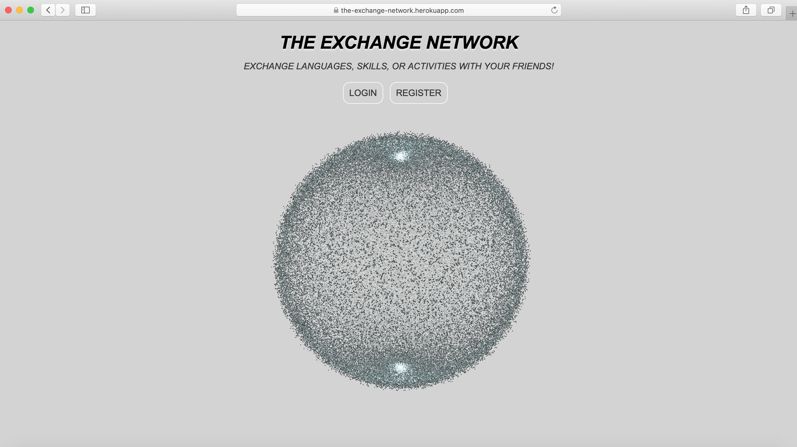

# the-social-network

Social network app developed with React.   
This social network is themed around the idea of exchange: its distinctive feature is that users can post messages in an "Exchange" section to exchange languages, skills, or services with other users.
  
FEATURES: users can register/login, find people, make friends, chat, post messages, change their profile picture, delete their account, and logout. Users can also reset their password: an email is automatically send to their address with a code that they have to provide to change it.    
Technologies: HTML, CSS, JavaScript, Node with Express.js, PostgreSQL  
Libraries: React, Three.js, Socket.IO, bcrypt  
Storage: AWS  
Tested with Jest
 
 
FUTURE IMPROVEMENT:  
At the moment, posts in the Exchange section are only visible to the users' friends.
To improve user experience, I am planning on updating this section to let users choose if their post should be private or public.
