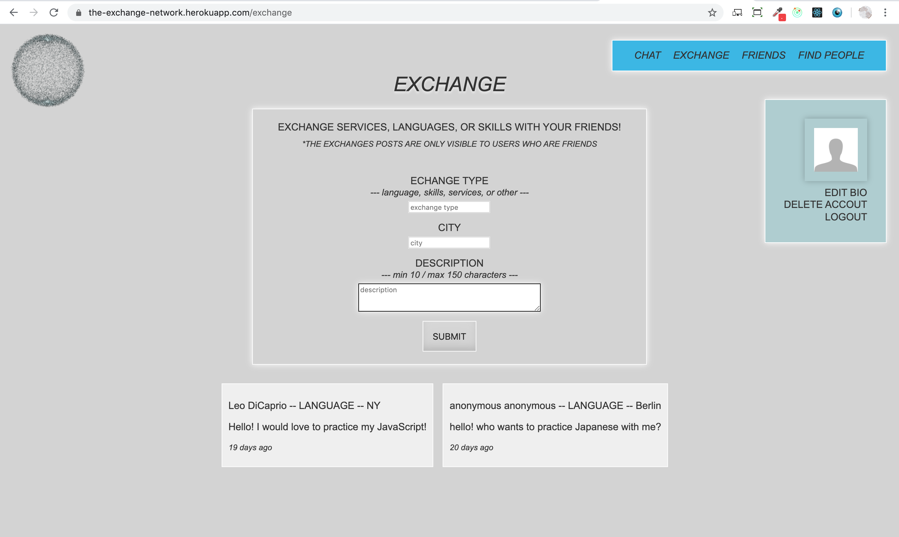
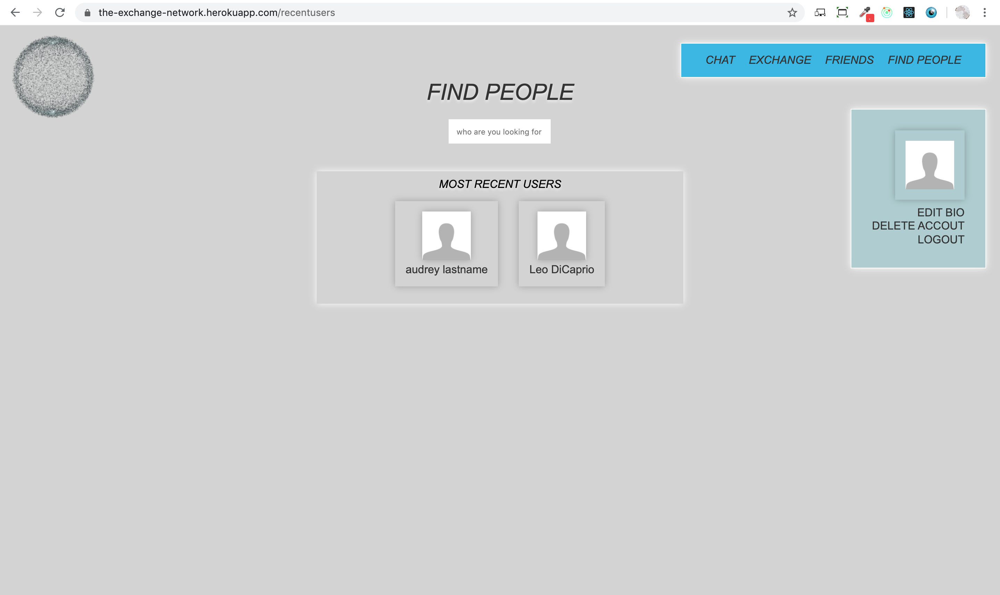

# React social network app

This React app is themed around the idea of exchange: its distinctive feature is that users can post messages in an "Exchange" section to exchange languages, skills, or services with their friends.

## Features

- register/login
- search & find other users
- make friends
- chat
- post messages in Exchange section
- delete account
- logout

Note: In development, I added features where the user could upload a custom image profile and reset the password through email using AWS. I've taken out both features in production to prevent the costs associated with AWS. The code for these features is commented out.

## Tech

<<<<<<< HEAD
**Stack**: HTML, CSS, JavaScript, Node with Express.js, PostgreSQL  
**Testing**: React Testing Library + Jest  
**Framework**: React | **Deployment**: Heroku

## Future improvements
=======
Social network app developed with React.   
This app is themed around the idea of exchange: its distinctive feature is that users can post messages in an "Exchange" section to exchange languages, skills, or services with their friends.
  
FEATURES: users can register/login, find people, make friends, chat, post messages, delete an account, and logout. In development, I added features where the user could upload a custom image profile and reset the password through
email using AWS. I've taken out both features in production to prevent the costs associated with AWS.   
***Tech stack:*** HTML, CSS, JavaScript, Node with Express.js, PostgreSQL  
***Libraries:*** React, Three.js, Socket.IO, bcrypt  
***Storage:*** AWS  
***Test:*** React Testing Library + Jest
 
 
FUTURE IMPROVEMENTS:  
>>>>>>> 62e16745c26d06e957d99048722e70d91246988f

- At the moment, posts in the Exchange section are only visible to the users' friends. To improve user experience, I am planning on updating this section to let users choose if their posts should be private or public.
- Another nice feature would be to assign a distinctive color to each user upon registration and then let
  the users change the color in the profile section.

## Visuals

