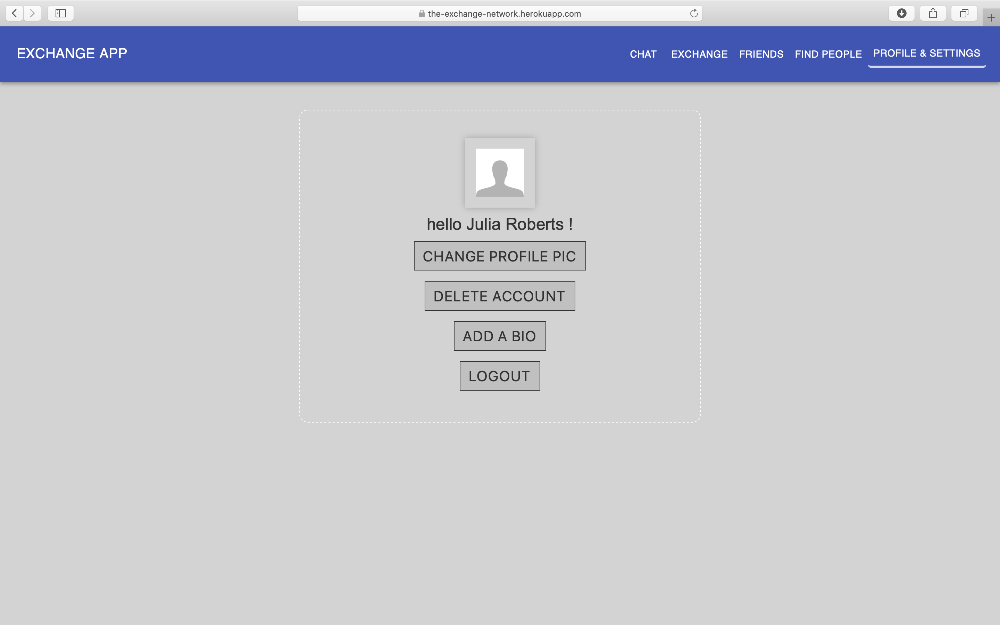
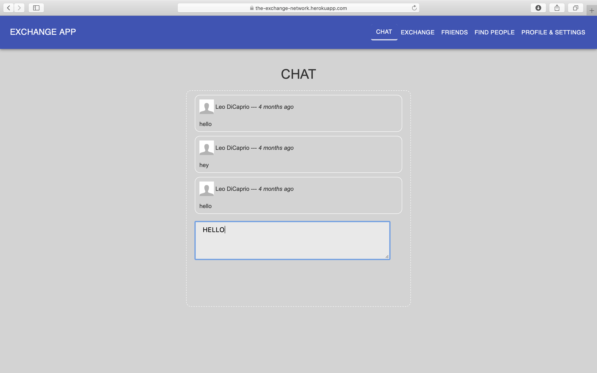

# React exchange network app

React app themed around the idea of exchange: users can post messages in an "Exchange" section to exchange languages, skills, or services with other people. Users can decide wether their posts should be visible to
all the users (public) or only visible to their friends (private).

[visit live app](https://the-exchange-network.herokuapp.com/)

## Features

- register/login (password hashed with bcrypt)
- change profile picture
- edit bio
- search & find other users
- make friends
- chat made with socket.io
- post messages in Exchange section (private or public option)
- logout
- delete account and all associated info

## Tech

**Stack**: SASS/SCSS, JavaScript, React, Node.js, Redux, PostgreSQL, socket.io, Three.js  
**Protection**: CSURF  
**Storage**: AWS in dev | Cloudinary in prod  
**Testing**: React Testing Library + Jest  
**Deployment**: Heroku

## Visuals

